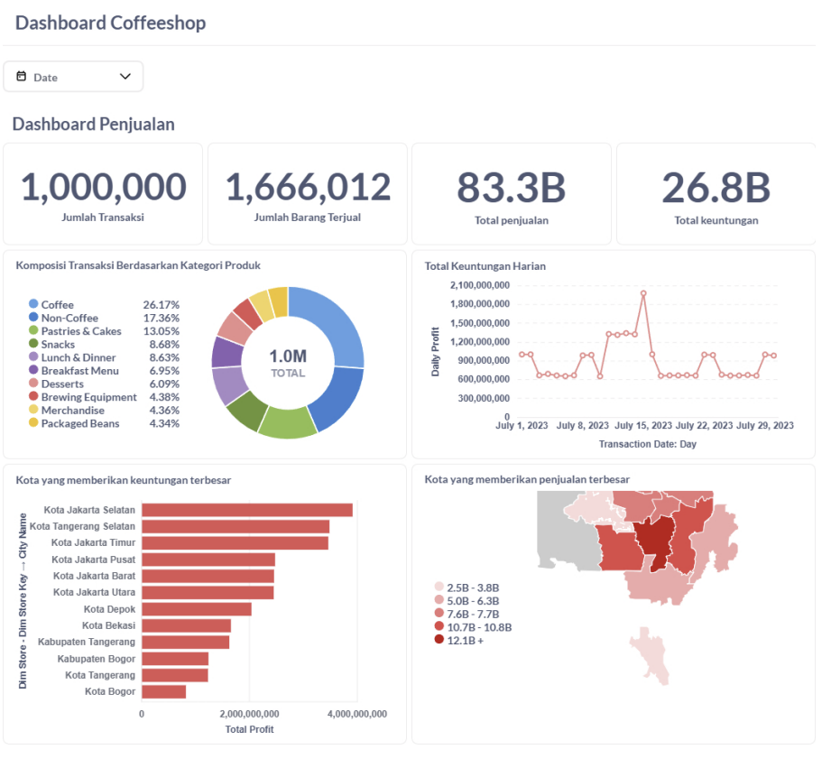

# Coffee Shop Sales Analysis

## Project Overview
Proyek ini menganalisis data penjualan kedai kopi dari database yang dibuat secara sintetis menggunakan library Faker. Dengan memanfaatkan arsitektur Medallion, proyek ini membangun pipeline data yang terstruktur untuk menghasilkan wawasan bisnis yang berharga. Data tersebut divisualisasikan dalam dashboard Metabase untuk memudahkan pemahaman kinerja penjualan.


## Latar Belakang Masalah
Kedai kopi kesulitan untuk memahami kinerja penjualannya secara mendalam. Proyek ini dibangun untuk menjawab pertanyaan-pertanyaan utama, seperti:
* Bagaimana tren penjualan secara keseluruhan?
* Produk mana yang paling laris dan kategori mana yang paling menguntungkan?
* Bagaimana performa penjualan di setiap lokasi toko?
* Apakah ada pola penjualan yang signifikan pada hari kerja, akhir pekan, atau jam-jam tertentu?
Tujuan utamanya adalah mengubah data mentah menjadi informasi yang dapat ditindaklanjuti untuk mengoptimalkan strategi penjualan dan meningkatkan performa bisnis.

## Teknologi Utama Yang Digunakan
* **Storage Layer** - Minio
* **File Format** -  Apache Parquet
* **Open Table Format** - Apache Iceberg
* **Metadata Catalog** - Local REST Catalog
* **Query Engine** - SparkSQL
* **Processing Engine** - Apache Spark
* **Analytics Tools** - Jupyter Lab
* **Orchectrator** - Apache Airflow 
* **BI Tools** - Metabase 

## Pembersihan dan Analisis Data
Data mentah diproses melalui tiga lapisan utama dalam arsitektur Medallion:
### Lapisan Bronze
Data mentah (raw) dari file CSV dimuat ke dalam data lake. Data ini disimpan dalam Minio dengan format Apache Parquet dan dikelola sebagai tabel Iceberg. Pada tahap ini, data disimpan apa adanya tanpa banyak transformasi.

### Lapisan Silver
Data dari lapisan Bronze diolah dan dibersihkan menggunakan Apache Spark. Operasi pembersihan meliputi:
* Validasi dan konversi tipe data.
* Penghapusan data duplikat.
* Penanganan nilai NULL atau data yang hilang. (Customer_ID pengecualian)
Hasilnya adalah tabel data yang bersih dan konsisten, siap untuk analisis lebih lanjut.

### Lapisan Gold
Data dari lapisan Silver diagregasi dan distrukturkan menjadi tabel fakta (fact_sales) dan tabel dimensi (dim_product, dim_store, dll.) yang telah dioptimalkan untuk kueri analitik. Lapisan ini menjadi sumber data utama untuk Metabase.

Visualisasi dan Wawasan
Dengan menggunakan Metabase, dashboard analitik dibangun untuk menampilkan berbagai metrik dan visualisasi, seperti:
* **Total Penjualan dan Keuntungan:** Metrik utama untuk memantau kesehatan bisnis secara keseluruhan.
* **Tren Harian:** Grafik yang menunjukkan pola penjualan dari hari ke hari untuk mengidentifikasi puncak dan lembah penjualan.
* **Performa Lokasi:** Grafik batang yang membandingkan penjualan antar toko di berbagai kota.
* **Analisis Kategori Produk:** Pie chart atau grafik batang untuk melihat komposisi penjualan berdasarkan kategori, membantu mengidentifikasi produk yang paling populer.
* **Analisis Waktu:** Heatmap atau grafik matriks untuk memahami pola penjualan per hari dan per jam, yang dapat digunakan untuk mengoptimalkan jam operasional.


## Penggunaan
1. **Clone repository**
   ```
   git clone https://github.com/ramadhnariq/dbcoffeeshopAMR
   cd minilake
   ```

2. **Jalankan docker**
   ```
   docker compose up -d
   ```
   
3. Mengakses service melalui browser:
   - **Jupyter Notebook :** http://localhost:8888
   - **Minio :** http://localhost:9001
   - **Metabase :** http://localhost:3000

## Hasil
